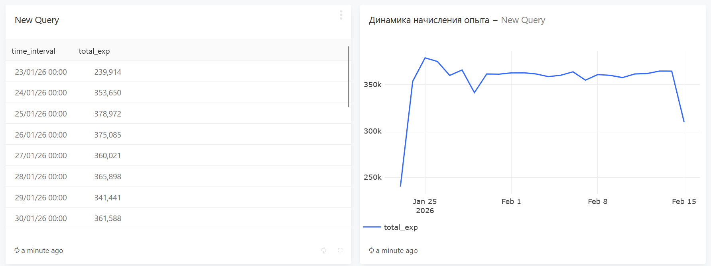
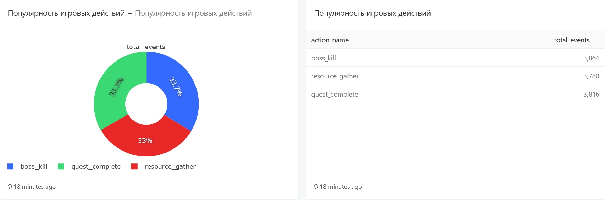
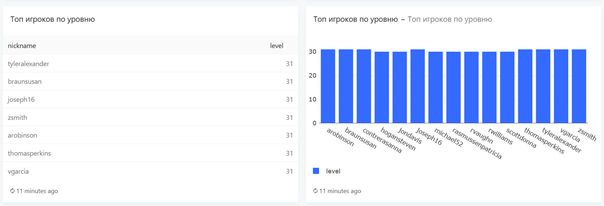

# Game Data Analytics System

A comprehensive project for simulating and analyzing player behavior. This system generates real-time game activity, stores it in a PostgreSQL database, and provides tools for data visualization via Redash and Jupyter Notebook.

## Setup

1. **Clone the repository:**
```bash
git clone https://github.com/Konst-iv/Mini-data-collection-and-analysis-system
```
2. **Launch Infrastructure (Docker):**
```bash
docker-compose up -d
```
3. **Set Up Analysis Environment (Jupyter):**
```bash
cd analysis
python -m venv .venv

# For Windows:
.venv\Scripts\activate
# For Linux/macOS:
source .venv/bin/activate

pip install -r requirements.txt
```
# Redash visualizations








